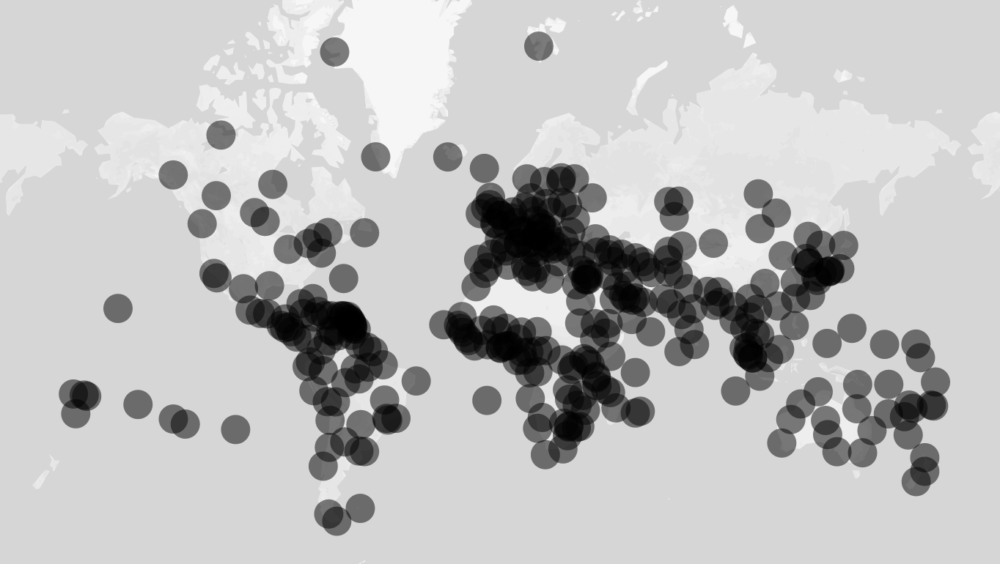

# react-map-gl-heatmap-overlay

A heatmap overlay for [react-map-gl](https://github.com/uber/react-map-gl) built
using [webgl-heatmap](https://github.com/vicapow/webgl-heatmap).



## Usage

````js
var HeatmapOverlay = require('react-map-gl-heatmap-overlay');
var cities = require('example-cities');
````

Where each element in cities looks like: `{latitude, longitude}`.

````js
    render: function render() {
      return <MapGL ...viewportProps>
        <HeatmapOverlay locations={cities} />
      </MapGL>;
    }
````

The `locations` prop can be an array or ImmutableJS List.

## Accessors

Data accessors can be provided if your data doesn't fit the expected
`{latitude, longitude}` form.

````js
    render: function render() {
      return <MapGL ...viewportProps>
        <HeatmapOverlay locations={houses}
          latLngAccessor: function latLngAccessor(house) {
            return [house.get('lat'), house.get('lng')];
          }
        />
      </MapGL>;
    }
````

Other accessors and their defaults:

````js
      intensityAccessor: function intensityAccessor(location) {
        return 1 / 10;
      }
````

````js
      sizeAccessor: function sizeAccessor(location) {
        return 40;
      }
````
